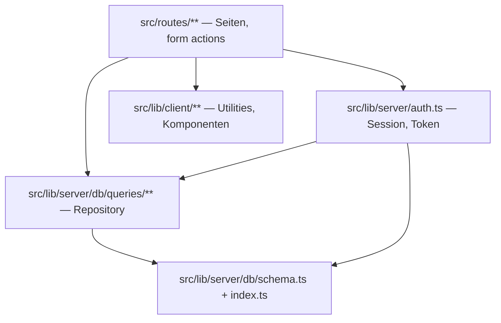
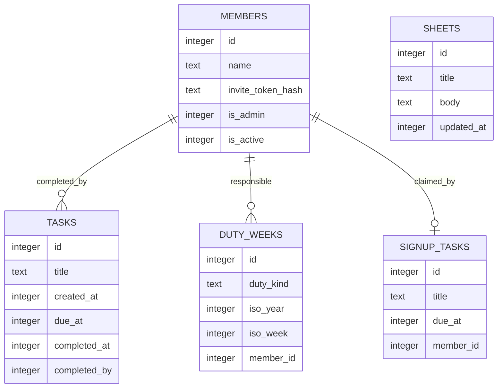

# Architecture Spine — Gartengemeinschaft-Koordinationswerkzeug

## Design Paradigm

**Geschichteter SSR-Monolith mit Repository-Schicht.** Eine SvelteKit-Anwendung, serverseitig gerendert, mit strikt einwärts gerichteten Abhängigkeiten. Drei Schichten:

| Schicht | Verzeichnis | Darf abhängen von |
| --- | --- | --- |
| Routen (Präsentation + HTTP) | `src/routes/` | Repository, Domänenhelfer, Client-Utilities |
| Repository (Datenzugriff) | `src/lib/server/db/queries/` | Schema, DB-Handle |
| Schema + Verbindung | `src/lib/server/db/` | nichts aus der App |

Kein Weg zurück nach oben. Die Anwendung ist ein einziger Prozess mit einer SQLite-Datei; es gibt keine Services, keine Warteschlangen, keine Hintergrundjobs.

## Invariants & Rules



### AD-1 — Datenzugriff ausschliesslich über die Repository-Schicht `[ADOPTED]`

- **Binds:** alle
- **Prevents:** Zwei Stories lesen oder schreiben dieselbe Entität mit unterschiedlichen Bedingungen; Abfragelogik liegt dupliziert in Routen und divergiert.
- **Rule:** Kein Drizzle-Aufruf und kein Zugriff auf das `db`-Handle ausserhalb von `src/lib/server/db/`. Routen importieren ausschliesslich benannte Funktionen aus `$lib/server/db/queries/*.ts`. Neue Abfragen entstehen dort, nie inline in einer Route.

### AD-2 — Die Datenschicht ist synchron `[ADOPTED]`

- **Binds:** alle Datenzugriffe
- **Prevents:** Eine Story wickelt Repository-Funktionen in Promises, eine andere nicht — die Signaturen der Schicht divergieren und Aufrufer brechen.
- **Rule:** `better-sqlite3` ist synchron. Repository-Funktionen geben Werte direkt zurück, nie ein `Promise`; kein `async`/`await` in `src/lib/server/db/`. `WAL` und `foreign_keys` werden beim Start in `db/index.ts` gesetzt, niemals in Migrationsdateien.

### AD-3 — Identität entsteht ausschliesslich aus einem Einladungstoken

- **Binds:** alle Schreibpfade, CAP-5, CAP-6, Stories 1, 4, 5
- **Prevents:** Eine Story baut den getippten Namen als Zugangsweg, eine andere den Einladungslink — es gäbe zwei Identitätsquellen und der Dienstplan wäre nicht mehr verbindlich.
- **Rule:** Ein Mitglied entsteht nur durch eine Einladung. `GET /i/<token>` ist der einzige Pfad, der ein Session-Cookie ausstellt. Danach ist die `member_id` aus dem signierten Cookie die einzige Identitätsquelle; kein Pfad liest eine Identität aus Formulareingaben. Namen werden ausschliesslich in der Mitgliederverwaltung (AD-11) angelegt oder geändert.

### AD-4 — Drei Aufgabentypen, drei Entitäten, keine gemeinsame Zuständigkeitsspalte

- **Binds:** CAP-1, CAP-2, CAP-4 gegenüber CAP-5, CAP-6
- **Prevents:** Eine Story hängt einen Zuständigen an Pool-Aufgaben, eine andere nicht — die Unterscheidung zwischen namenlosem Pool und verbindlichem Dienst zerfällt und der Constraint aus der Spec bricht.
- **Rule:** Drei getrennte Tabellen. `tasks` hat **keine** Spalte für einen vorab Zuständigen. `duty_weeks` hat genau eine `member_id` pro Woche (NOT NULL). `signup_tasks` hat eine nullbare `member_id` (0 oder 1 Übernehmer). Keine gemeinsame Basistabelle, keine Typspalte über alle drei.

### AD-5 — Wer abgehakt hat, wird gespeichert, aber nicht angezeigt

- **Binds:** CAP-2, Story 1
- **Prevents:** Eine Story zeigt den Abhakenden in der Liste, eine andere nicht. Die sichtbare Zuschreibung erzeugt soziale Kosten und untergräbt genau das Verhalten, auf dem die ganze Anwendung beruht.
- **Rule:** `tasks.completed_by` und `tasks.completed_at` werden gesetzt und bilden die Historie. In der Aufgabenliste und in allen Ansichten erscheint ausschliesslich, **dass** etwas erledigt ist, nie **von wem**. Eine Ansicht, die `completed_by` einem Namen zuordnet, existiert nicht.

### AD-6 — Zeitstempel sind Unix-Sekunden `[ADOPTED]`

- **Binds:** alle
- **Prevents:** Eine Story speichert Millisekunden oder ISO-Strings — Vergleiche und Fristberechnungen werden stumm falsch.
- **Rule:** Alle Zeitspalten sind SQLite-Integer mit Unix-Sekunden. `Math.floor(Date.now() / 1000)` für „jetzt". Keine `Date`-Objekte, keine ISO-Strings in der Datenbank. Formatierung ausschliesslich über die Utilities in `src/lib/client/utils/date.ts`.

### AD-7 — Aktualität ist eine Holschuld des Clients, es gibt keine Push-Kanäle

- **Binds:** CAP-1, CAP-2
- **Prevents:** Eine Story baut Intervall-Polling, eine andere Server-Sent Events — zwei Aktualisierungsmechanismen, von denen einer hinter nginx anders puffert als erwartet.
- **Rule:** Daten kommen ausschliesslich aus `load`-Funktionen beim Laden einer Route. Nach jeder Mutation `invalidateAll()` aus `$app/navigation`. Kein `setInterval`-Polling, kein SSE, kein WebSocket, keine Push-Benachrichtigung.

### AD-8 — Überfälligkeit ist abgeleitet, nicht gespeichert

- **Binds:** Story 3
- **Prevents:** Eine Story setzt ein `is_overdue`-Flag per Job, eine andere berechnet es beim Anzeigen — zwei Wahrheiten, die auseinanderlaufen, sobald der Job einmal nicht läuft.
- **Rule:** Jede Aufgabe hat ein optionales `due_at`. Überfällig heisst `completed_at IS NULL AND (COALESCE(due_at, created_at) < jetzt − 21 Tage)`, berechnet zur Anzeigezeit. Keine `is_overdue`-Spalte, kein Cron, kein Hintergrundjob. Die Schwelle liegt als benannte Konstante an einer Stelle. Der Monatsplan (CAP-3) setzt `due_at` einmal für den ganzen Stapel; die Ad-hoc-Erfassung (CAP-4) lässt es leer.

### AD-9 — Mutationen laufen über form actions, nie über JSON-Endpunkte

- **Binds:** alle Schreibpfade
- **Prevents:** Eine Story schreibt über `+server.ts`, eine andere über eine form action — zwei Fehlerbehandlungen, zwei Validierungsorte, und `use:enhance` greift nur bei der Hälfte.
- **Rule:** Jede Änderung an Domänendaten ist eine form action in `+page.server.ts`, aufgerufen von einem `<form method="POST">` mit `use:enhance`. Kein Mischen von form actions und Request-Handlern in derselben Route. Genau eine Ausnahme: `GET /i/<token>` (AD-3) verändert ausschliesslich die Sitzung, nie Domänendaten, und darf deshalb ein `+server.ts` sein.

### AD-10 — Einladungstokens liegen nur als Hash in der Datenbank

- **Binds:** AD-3, AD-11
- **Prevents:** Eine Story speichert das Token im Klartext, damit der Verwaltungsbereich den Link erneut anzeigen kann — ein Datenbankleck gibt damit unmittelbar Zugang für alle Mitglieder.
- **Rule:** 32 Byte aus `crypto.randomBytes`, base64url kodiert im Link. In `members.invite_token_hash` liegt ausschliesslich der SHA-256-Hash. Der Klartext-Link wird genau einmal nach dem Erzeugen angezeigt und danach nie wieder rekonstruierbar. Das Token bleibt bis zum Widerruf gültig und mehrfach einlösbar, damit ein Gerätewechsel keinen neuen Link braucht.

### AD-11 — Mitgliederverwaltung ist ein eigener, geschützter Bereich

- **Binds:** AD-3, AD-10
- **Prevents:** Jede Story, die einen Namen oder eine Einladung braucht, baut ihre eigene kleine Verwaltung — es gäbe mehrere Orte, an denen Mitglieder entstehen.
- **Rule:** Alles unter `/verwaltung` erfordert ein Mitglied mit `members.is_admin = 1`. Einladungen erzeugen, widerrufen und Mitglieder deaktivieren geschieht ausschliesslich dort. Keine andere Route legt ein Mitglied an; einzige Ausnahme ist das CLI-Skript `scripts/create-admin.ts` für das allererste Admin-Mitglied. Ein deaktiviertes Mitglied wird nie gelöscht: `tasks.completed_by` bleibt erhalten, und seine künftigen `duty_weeks` bleiben als Datensatz stehen, werden aber überall als **unbesetzt** dargestellt, bis die Verwaltung sie neu besetzt.

### AD-12 — Der Service Worker cacht keine Daten

- **Binds:** CAP-1, alle Listenansichten
- **Prevents:** Eine Story aktiviert Runtime-Caching für die Aufgabenliste, um sie „schneller" zu machen — Gärtner\*innen sehen dann erledigte Aufgaben als offen, was der Kernnutzen der Anwendung ist.
- **Rule:** `vite-plugin-pwa` liefert ausschliesslich Manifest und Icons. Kein `navigateFallback`, keine `runtimeCaching`-Regel auf `/` oder auf serverseitig gerenderte Routen. Nur unveränderliche Build-Assets dürfen im Precache liegen.

### AD-13 — Pflicht-Umgebungsvariablen brechen beim Start, nicht im Betrieb `[ADOPTED]`

- **Binds:** Betrieb, alle Module mit Konfiguration
- **Prevents:** Ein fehlendes Geheimnis fällt erst beim ersten Login auf, nachdem der Container als „gesund" gemeldet wurde.
- **Rule:** `DATABASE_PATH` und `SESSION_SECRET` werfen beim Modulladen, wenn nicht gesetzt. Kein Fallback-Standardwert, nie. Jede neue Pflichtvariable folgt demselben Muster.

### AD-14 — Die Startseite ist die einzige Antwort auf „was ist zu tun"

- **Binds:** CAP-1, CAP-5, CAP-6, Stories 1, 4, 5
- **Prevents:** Story 1 rendert nur den Aufgaben-Pool und Story 5 legt die Einzelaufgaben auf eine eigene Seite — beide halten jede Regel ein, und trotzdem sieht niemand beim Öffnen, dass Setzlinge abzuholen sind.
- **Rule:** Die Startseite `/` führt genau drei Blöcke in dieser Reihenfolge: (1) einen Hinweis, falls die betrachtende Person diese Woche Dienst hat, (2) offene Einzelaufgaben ohne Übernehmer, (3) den offenen Aufgaben-Pool. Eine neue Aufgabenart erscheint nur dann in der Anwendung, wenn sie auch hier einsortiert wird. Unterseiten dürfen vertiefen, nie exklusiv informieren.

## Consistency Conventions

| Concern | Convention |
| --- | --- |
| Komponenten | PascalCase `.svelte` in `src/lib/components/` |
| Routendateien | Nur SvelteKit-Konventionen: `+page.svelte`, `+page.server.ts`, `+server.ts`, `+layout.svelte`, `+layout.server.ts` |
| Repository-Dateien | camelCase, nach Domäne benannt: `tasks.ts`, `dutyWeeks.ts`, `signupTasks.ts`, `sheets.ts`, `members.ts` |
| Tabellen und Spalten | snake_case im Schema, camelCase in TypeScript (Drizzle-Mapping) |
| Zeilentypen | Immer Drizzles `$inferSelect` / `$inferInsert`; keine handgeschriebenen Interfaces für Tabellen |
| Einfügewerte | `satisfies NewTask` (usw.) auf `.values({...})`, damit Schemaabweichungen beim Kompilieren auffallen |
| Importe | `$lib/...` für alles aus `src/lib/`; lokale TypeScript-Dateien mit `.js`-Endung importieren (ESM + `moduleResolution: bundler`) |
| Fehler in Routen | SvelteKit-`error(status, { message })`, nie `throw new Error` in Routendateien |
| Zustandsverwaltung | Svelte 5 Runes: `$props()`, `$state()`, `$derived()`, `$effect()`. Kein `export let`, kein `$:`, keine `svelte/store`-Writables |
| Sprache der Oberfläche | Durchgehend Deutsch, `<html lang="de">` |
| Farben | Ausschliesslich CSS Custom Properties, keine Hex-Werte in Komponenten-`<style>` |
| Touch-Ziele | Jedes interaktive Element `min-height: 44px`; Inhaltsbreite `max-width: 600px; margin: 0 auto` |
| Migrationen | `npm run db:generate` nach Schemaänderung; Migrationsdateien nie von Hand bearbeiten |
| Qualitätstore | `npm run build` und `npm run lint` müssen sauber durchlaufen, bevor eine Story fertig ist |

## Stack

| Name | Version |
| --- | --- |
| Node.js (Basis-Image `node:24-alpine`) | 24 LTS „Krypton" (v24.19.0) |
| SvelteKit | 2.70.3 |
| Svelte | 5.56.10 |
| @sveltejs/adapter-node | 5.5.7 |
| @sveltejs/vite-plugin-svelte | 7.3.0 |
| TypeScript | 6.0.3 |
| Vite | 8.2.2 |
| drizzle-orm | 0.45.2 |
| drizzle-kit | 0.31.10 |
| better-sqlite3 | 13.0.3 |
| jose | 6.2.10 |
| vite-plugin-pwa | 1.3.0 |
| workbox-window | 7.4.1 |
| @types/better-sqlite3 | 9.6.0 |
| ESLint | 10.9.1 |
| eslint-plugin-svelte | 3.23.0 |
| typescript-eslint | 8.68.0 |
| Prettier | 3.9.6 |
| nginx | alpine |
| certbot | certbot/certbot latest |

TypeScript ist bewusst auf 6.0.3 gepinnt, obwohl 7.0.2 verfügbar ist: SvelteKit, `svelte-check` und `typescript-eslint` deklarieren alle drei Obergrenzen unter 7.

## Structural Seed

### Kernentitäten



`duty_weeks` ist eindeutig über (`duty_kind`, `iso_year`, `iso_week`) — genau eine zuständige Person pro Dienstwoche. Ein Tausch ist ein `UPDATE` der `member_id`, kein neuer Datensatz.

### Deployment und Umgebungen


Zwei Umgebungen: **lokal** (`npm run dev`, SQLite-Datei aus `.env.local`, kein Service Worker) und **Produktion** (`docker compose up -d` auf dem VPS). Kein Staging — bei dieser Grösse ist es Aufwand ohne Gegenwert.

Der `app`-Service veröffentlicht keinen Port; nginx erreicht ihn nur über das interne Bridge-Netz. Die Body-Grösse bleibt auf dem SvelteKit-Standard und `client_max_body_size 1M` in nginx — es gibt keine Uploads. Die Ratenbegrenzung aus der Referenz wandert von `/login` auf `/i/` (Einladungspfad), um das Erraten von Tokens zu bremsen.

### Quellbaum

```text
src/
  routes/
    +layout.server.ts      # Session lesen, Zugang erzwingen, öffentliche Pfade ausnehmen
    +page.svelte           # Aufgabenliste — CAP-1, CAP-2
    aufgabe/               # Ad-hoc erfassen — CAP-4
    monatsplan/            # Massen-Eingabe — CAP-3
    dienstplan/            # CAP-5
    einzelaufgaben/        # CAP-6
    wissen/                # Referenz-Sheets — CAP-7
    i/[token]/+server.ts   # Einladung einlösen, Cookie setzen — AD-3
    verwaltung/            # Mitglieder und Einladungen — AD-11
  lib/
    server/
      db/
        index.ts           # Verbindung, WAL, foreign_keys, migrate() beim Start
        schema.ts
        migrations/
        queries/           # Repository — AD-1
      auth.ts              # Cookie ausstellen und lesen, Token hashen — AD-10
    client/
      utils/date.ts        # AD-6
    components/
scripts/
  create-admin.ts          # erstes Admin-Mitglied anlegen
  backup.sh
nginx/
  nginx.conf
  conf.d/app.conf
```

## Capability → Architecture Map

| Capability / Area | Lives in | Governed by |
| --- | --- | --- |
| CAP-1 Aufgaben sehen | `routes/+page.svelte`, `queries/tasks.ts` | AD-1, AD-7, AD-12, AD-14 |
| CAP-2 Abhaken | form action in `routes/+page.server.ts` | AD-5, AD-9, AD-7 |
| CAP-3 Monatsplan ablegen | `routes/monatsplan/` | AD-1, AD-8, AD-9 |
| CAP-4 Ad-hoc erfassen | `routes/aufgabe/` | AD-1, AD-4, AD-9 |
| CAP-5 Dienstplan | `routes/dienstplan/`, `queries/dutyWeeks.ts` | AD-3, AD-4, AD-11, AD-14 |
| CAP-6 Einzelaufgabe mit Anmeldung | `routes/einzelaufgaben/` | AD-3, AD-4, AD-9, AD-14 |
| CAP-7 Referenz-Sheets | `routes/wissen/`, `queries/sheets.ts` | AD-1, AD-9 |
| Überfälligkeit (Story 3) | Anzeigelogik der Liste | AD-8 |
| Zugang und Identität | `routes/i/[token]/`, `lib/server/auth.ts` | AD-3, AD-10, AD-13 |
| CAP-8 Mitglieder aufnehmen und Zugang beenden | `routes/verwaltung/`, `routes/i/[token]/`, `queries/members.ts` | AD-11, AD-10, AD-3 |
| Betrieb | `docker-compose.yml`, `nginx/`, `scripts/backup.sh` | AD-13 |

## Deferred

- **Testframework.** Die Referenz hat keins; die Qualitätstore sind `npm run build` und `npm run lint` plus manuelles Testen am 375px-Viewport. Entscheidbar, sobald eine Story tatsächlich unter Regressionen leidet.
- **Genaue Ratenbegrenzung auf `/i/`.** Dass sie dort greift, ist entschieden (AD-3, AD-10); der konkrete Wert gehört in die nginx-Konfiguration der Deploy-Story.
- **Wo das Image gebaut wird.** Zunächst auf dem VPS wie in der Referenz. Falls die nativen Kompilate von `better-sqlite3` den VPS light überfordern, ist der Ausweg ein lokal gebautes Image über eine Registry — eine Betriebsentscheidung, kein Architekturbruch.
- **Sichtbarkeit der Namensliste innerhalb der Gemeinschaft.** Dass Aussenstehende sie nicht sehen, ist durch AD-3 entschieden. Ob jedes Mitglied alle Namen sieht, ist eine Produktfrage und keine Invariante.
- **Mehrere Dienstarten.** `duty_weeks.duty_kind` lässt sie zu, aber nur der Tränkeplan ist gefordert. Eine zweite Dienstart braucht keine Architekturänderung.
