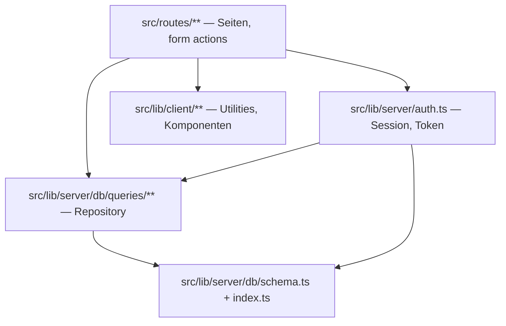
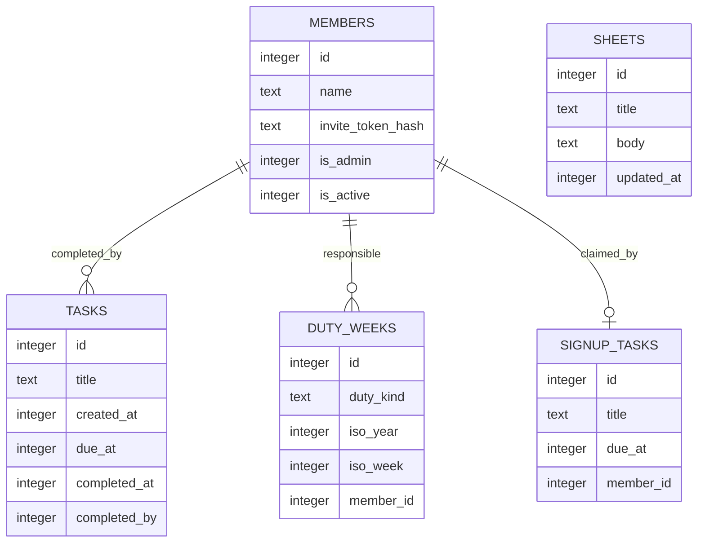
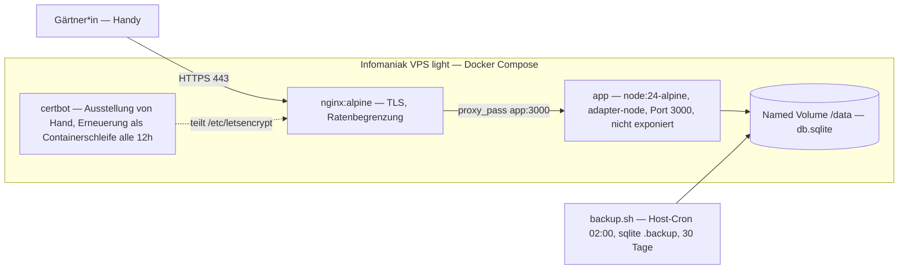

# Architecture Spine — Gartengemeinschaft-Koordinationswerkzeug

## Design Paradigm

**Geschichteter SSR-Monolith mit Repository-Schicht.** Eine SvelteKit-Anwendung, serverseitig gerendert, mit strikt einwärts gerichteten Abhängigkeiten. Drei Schichten:

| Schicht | Verzeichnis | Darf abhängen von |
| --- | --- | --- |
| Routen (Präsentation + HTTP) | `src/routes/` | Repository, Domänenhelfer, Client-Utilities |
| Repository (Datenzugriff) | `src/lib/server/db/queries/` | Schema, DB-Handle |
| Schema + Verbindung | `src/lib/server/db/` | nichts aus der App |

Kein Weg zurück nach oben. Die Anwendung ist ein einziger Prozess mit einer SQLite-Datei; es gibt keine Services, keine Warteschlangen, keine Hintergrundjobs.

## Invariants & Rules



### AD-1 — Datenzugriff ausschliesslich über die Repository-Schicht `[ADOPTED]`

- **Binds:** alle
- **Prevents:** Zwei Stories lesen oder schreiben dieselbe Entität mit unterschiedlichen Bedingungen; Abfragelogik liegt dupliziert in Routen und divergiert.
- **Rule:** Kein Drizzle-Aufruf und kein Zugriff auf das `db`-Handle ausserhalb von `src/lib/server/db/`. Routen importieren ausschliesslich benannte Funktionen aus `$lib/server/db/queries/*.ts`. Neue Abfragen entstehen dort, nie inline in einer Route.

### AD-2 — Die Datenschicht ist synchron `[ADOPTED]`

- **Binds:** alle Datenzugriffe
- **Prevents:** Eine Story wickelt Repository-Funktionen in Promises, eine andere nicht — die Signaturen der Schicht divergieren und Aufrufer brechen.
- **Rule:** `better-sqlite3` ist synchron. Repository-Funktionen geben Werte direkt zurück, nie ein `Promise`; kein `async`/`await` in `src/lib/server/db/`. `WAL` und `foreign_keys` werden beim Start in `db/index.ts` gesetzt, niemals in Migrationsdateien.

### AD-3 — Identität entsteht ausschliesslich aus einem Einladungstoken

- **Binds:** alle Schreibpfade, CAP-5, CAP-6, Stories 1, 4, 5
- **Prevents:** Eine Story baut den getippten Namen als Zugangsweg, eine andere den Einladungslink — es gäbe zwei Identitätsquellen und der Dienstplan wäre nicht mehr verbindlich.
- **Rule:** Ein Mitglied entsteht nur durch eine Einladung. `GET /i/<token>` ist der einzige Pfad, der ein Session-Cookie ausstellt. Danach ist die `member_id` aus dem signierten Cookie die einzige Identitätsquelle; kein Pfad liest eine Identität aus Formulareingaben. Namen werden ausschliesslich in der Mitgliederverwaltung (AD-11) angelegt oder geändert.

### AD-4 — Drei Aufgabentypen, drei Entitäten, keine gemeinsame Zuständigkeitsspalte

- **Binds:** CAP-1, CAP-2, CAP-4 gegenüber CAP-5, CAP-6
- **Prevents:** Eine Story hängt einen Zuständigen an Pool-Aufgaben, eine andere nicht — die Unterscheidung zwischen namenlosem Pool und verbindlichem Dienst zerfällt und der Constraint aus der Spec bricht.
- **Rule:** Drei getrennte Tabellen. `tasks` hat **keine** Spalte für einen vorab Zuständigen. `duty_weeks` hat genau eine `member_id` pro Woche (NOT NULL). `signup_tasks` hat eine nullbare `member_id` (0 oder 1 Übernehmer). Keine gemeinsame Basistabelle, keine Typspalte über alle drei.

### AD-5 — Wer abgehakt hat, wird gespeichert, aber nicht angezeigt

- **Binds:** CAP-2, Story 1
- **Prevents:** Eine Story zeigt den Abhakenden in der Liste, eine andere nicht. Die sichtbare Zuschreibung erzeugt soziale Kosten und untergräbt genau das Verhalten, auf dem die ganze Anwendung beruht.
- **Rule:** `tasks.completed_by` und `tasks.completed_at` werden gesetzt und bilden die Historie. In der Aufgabenliste und in allen Ansichten erscheint ausschliesslich, **dass** etwas erledigt ist, nie **von wem**. Eine Ansicht, die `completed_by` einem Namen zuordnet, existiert nicht.

### AD-6 — Zeitstempel sind Unix-Sekunden `[ADOPTED]`

- **Binds:** alle
- **Prevents:** Eine Story speichert Millisekunden oder ISO-Strings — Vergleiche und Fristberechnungen werden stumm falsch.
- **Rule:** Alle Zeitspalten sind SQLite-Integer mit Unix-Sekunden. `Math.floor(Date.now() / 1000)` für „jetzt". Keine `Date`-Objekte, keine ISO-Strings in der Datenbank. Formatierung ausschliesslich über die Utilities in `src/lib/client/utils/date.ts`.

### AD-7 — Aktualität ist eine Holschuld des Clients, es gibt keine Push-Kanäle

- **Binds:** CAP-1, CAP-2
- **Prevents:** Eine Story baut Intervall-Polling, eine andere Server-Sent Events — zwei Aktualisierungsmechanismen, von denen einer hinter nginx anders puffert als erwartet.
- **Rule:** Daten kommen ausschliesslich aus `load`-Funktionen beim Laden einer Route. Nach jeder Mutation `invalidateAll()` aus `$app/navigation`. Kein `setInterval`-Polling, kein SSE, kein WebSocket, keine Push-Benachrichtigung.

### AD-8 — Überfälligkeit ist abgeleitet, nicht gespeichert

- **Binds:** Story 3
- **Prevents:** Eine Story setzt ein `is_overdue`-Flag per Job, eine andere berechnet es beim Anzeigen — zwei Wahrheiten, die auseinanderlaufen, sobald der Job einmal nicht läuft.
- **Rule:** Jede Aufgabe hat ein optionales `due_at`. Überfällig heisst `completed_at IS NULL AND (COALESCE(due_at, created_at) < jetzt − 21 Tage)`, berechnet zur Anzeigezeit. Keine `is_overdue`-Spalte, kein Cron, kein Hintergrundjob. Die Schwelle liegt als benannte Konstante an einer Stelle. Der Monatsplan (CAP-3) setzt `due_at` einmal für den ganzen Stapel; die Ad-hoc-Erfassung (CAP-4) lässt es leer.

### AD-9 — Mutationen laufen über form actions, nie über JSON-Endpunkte

- **Binds:** alle Schreibpfade
- **Prevents:** Eine Story schreibt über `+server.ts`, eine andere über eine form action — zwei Fehlerbehandlungen, zwei Validierungsorte, und `use:enhance` greift nur bei der Hälfte.
- **Rule:** Jede Änderung an Domänendaten ist eine form action in `+page.server.ts`, aufgerufen von einem `<form method="POST">` mit `use:enhance`. Kein Mischen von form actions und Request-Handlern in derselben Route. Genau eine Ausnahme: `GET /i/<token>` (AD-3) verändert ausschliesslich die Sitzung, nie Domänendaten, und darf deshalb ein `+server.ts` sein.

### AD-10 — Einladungstokens liegen nur als Hash in der Datenbank

- **Binds:** AD-3, AD-11
- **Prevents:** Eine Story speichert das Token im Klartext, damit der Verwaltungsbereich den Link erneut anzeigen kann — ein Datenbankleck gibt damit unmittelbar Zugang für alle Mitglieder.
- **Rule:** 32 Byte aus `crypto.randomBytes`, base64url kodiert im Link. In `members.invite_token_hash` liegt ausschliesslich der SHA-256-Hash. Der Klartext-Link wird genau einmal nach dem Erzeugen angezeigt und danach nie wieder rekonstruierbar. Das Token bleibt bis zum Widerruf gültig und mehrfach einlösbar, damit ein Gerätewechsel keinen neuen Link braucht.

### AD-11 — Mitgliederverwaltung ist ein eigener, geschützter Bereich

- **Binds:** AD-3, AD-10
- **Prevents:** Jede Story, die einen Namen oder eine Einladung braucht, baut ihre eigene kleine Verwaltung — es gäbe mehrere Orte, an denen Mitglieder entstehen.
- **Rule:** Alles unter `/verwaltung` erfordert ein Mitglied mit `members.is_admin = 1`. Einladungen erzeugen, widerrufen und Mitglieder deaktivieren geschieht ausschliesslich dort. Keine andere Route legt ein Mitglied an; einzige Ausnahme ist das CLI-Skript `scripts/create-admin.ts` für das allererste Admin-Mitglied. Ein deaktiviertes Mitglied wird nie gelöscht: `tasks.completed_by` bleibt erhalten, und seine künftigen `duty_weeks` bleiben als Datensatz stehen, werden aber überall als **unbesetzt** dargestellt, bis die Verwaltung sie neu besetzt.

### AD-12 — Es gibt keinen Service Worker, und darum cacht keiner Daten

- **Binds:** CAP-1, alle Listenansichten
- **Prevents:** Eine Story aktiviert Runtime-Caching für die Aufgabenliste, um sie „schneller" zu machen — Gärtner\*innen sehen dann erledigte Aufgaben als offen, was der Kernnutzen der Anwendung ist.
- **Rule:** Kein Service Worker. `static/manifest.webmanifest` und `static/icons/` genügen für die Installation zum Home-Bildschirm; sie werden statisch ausgeliefert und von nichts erzeugt. Wer je einen einführt, darf keine `runtimeCaching`-Regel auf `/` oder auf eine serverseitig gerenderte Route legen und keinen `navigateFallback` setzen — nur unveränderliche Build-Assets dürfen in einen Precache.

> **Nachgezogen am 2026-08-30** (Retro Epic 1, Befund B6). Die Regel nannte bis dahin `vite-plugin-pwa` als ihren Träger. Das Paket ist nie installiert worden, `workbox-window` ebenso wenig; beide standen trotzdem in der Stack-Tabelle. Das **Ergebnis** war die ganze Zeit besser als geplant — ohne Service Worker kann nichts cachen —, aber eine bindende Regel zeigte auf ein Nichts. Der Grund stand nur in `spec-1-1` und in `README.md`, nicht hier.

### AD-13 — Pflicht-Umgebungsvariablen brechen beim Start, nicht im Betrieb `[ADOPTED]`

- **Binds:** Betrieb, alle Module mit Konfiguration
- **Prevents:** Ein fehlendes Geheimnis fällt erst beim ersten Login auf, nachdem der Container als „gesund" gemeldet wurde.
- **Rule:** `DATABASE_PATH`, `SESSION_SECRET` und `ORIGIN` werfen **beim Start des Servers**, wenn sie fehlen oder nicht taugen — geprüft in `startPruefen()`, aufgerufen aus dem `init`-Hook in `src/hooks.server.ts`. Kein Fallback-Standardwert, nie. Jede neue Pflichtvariable folgt demselben Muster.

> **Nachgezogen am 2026-08-30** (Retro Epic 1, Befund B7). Zwei Korrekturen an einer Regel, deren **Absicht** immer erfüllt war: kein Fallback, lauter Abbruch vor der ersten Antwort.
>
> **Der Ort.** „Beim Modulladen" war nicht bloss ungenau, sondern unbaubar: die Prüfungen dort machten `npm run build` ohne `.env` unmöglich — gemessen, nicht vermutet, und mit der Begründung an Ort und Stelle in `hooks.server.ts`. Der `init`-Hook läuft vor der ersten Anfrage und nach dem Bauen; das ist der Ort, den die Absicht meint.
>
> **Die dritte Variable.** `ORIGIN` (`src/lib/server/herkunft.ts`) ist seit Story 1.6 Pflicht — SvelteKit weist ohne sie jeden POST als Herkunftsverstoss ab —, und der Plan nannte sie nirgends.

### AD-14 — Die Startseite ist die einzige Antwort auf „was ist zu tun"

- **Binds:** CAP-1, CAP-5, CAP-6, Stories 1, 4, 5
- **Prevents:** Story 1 rendert nur den Aufgaben-Pool und Story 5 legt die Einzelaufgaben auf eine eigene Seite — beide halten jede Regel ein, und trotzdem sieht niemand beim Öffnen, dass Setzlinge abzuholen sind.
- **Rule:** Die Startseite `/` führt genau drei Blöcke in dieser Reihenfolge: (1) einen Hinweis, falls die betrachtende Person diese Woche Dienst hat, (2) offene Einzelaufgaben ohne Übernehmer, (3) den offenen Aufgaben-Pool. Eine neue Aufgabenart erscheint nur dann in der Anwendung, wenn sie auch hier einsortiert wird. Unterseiten dürfen vertiefen, nie exklusiv informieren.

## Consistency Conventions

| Concern | Convention |
| --- | --- |
| Komponenten | PascalCase `.svelte` in `src/lib/components/` |
| Routendateien | Nur SvelteKit-Konventionen: `+page.svelte`, `+page.server.ts`, `+server.ts`, `+layout.svelte`, `+layout.server.ts` |
| Repository-Dateien | **kebab-case**, nach Domäne benannt: `tasks.ts`, `duty-weeks.ts`, `signup-tasks.ts`, `sheets.ts`, `members.ts`. Bis zum 2026-08-30 stand hier `camelCase` — gebaut war von Anfang an kebab-case, und der Abweichungsblock am Quellbaum hielt das schon fest, während diese Zeile das Gegenteil vorschrieb. Die Regel folgt jetzt dem Baum. |
| Tabellen und Spalten | snake_case im Schema, camelCase in TypeScript (Drizzle-Mapping) |
| **Sprache der Spalten** | **Domänenspalten deutsch, Infrastrukturspalten englisch.** Entschieden am 2026-08-30. Domäne ist, was die Gartengemeinschaft benennt (`titel`, `termin_at`, `iso_jahr`, `iso_woche`); Infrastruktur ist, was jede Tabelle trägt (`id`, `created_at`, `member_id`, `is_active`, `completed_at`). Ein deutsches Nomen mit englischem `_at`-Suffix ist die richtige Mischform, nicht ein Bruch. |
| Zeilentypen | Immer Drizzles `$inferSelect` / `$inferInsert`; keine handgeschriebenen Interfaces für Tabellen |
| Einfügewerte | `satisfies NewTask` (usw.) auf `.values({...})`, damit Schemaabweichungen beim Kompilieren auffallen |
| Importe | `$lib/...` für alles aus `src/lib/`; lokale TypeScript-Dateien mit `.js`-Endung importieren (ESM + `moduleResolution: bundler`) |
| Fehler in Routen | SvelteKit-`error(status, { message })`, nie `throw new Error` in Routendateien |
| Zustandsverwaltung | Svelte 5 Runes: `$props()`, `$state()`, `$derived()`, `$effect()`. Kein `export let`, kein `$:`, keine `svelte/store`-Writables |
| Sprache der Oberfläche | Durchgehend Deutsch, `<html lang="de">` |
| Farben | Ausschliesslich CSS Custom Properties, keine Hex-Werte in Komponenten-`<style>` |
| Touch-Ziele | Jedes interaktive Element `min-height: 44px`; Inhaltsbreite `max-width: 600px; margin: 0 auto` |
| Migrationen | `npm run db:generate` nach Schemaänderung; Migrationsdateien nie von Hand bearbeiten |

> **Zur Sprache der Spalten, entschieden am 2026-08-30** (Retro Epic 3, Befund D1; Aktionspunkt `epic-3-retro-item-42`).
>
> Die Retrospektiven zu Epic 2 und Epic 3 haben den Baum als „nach Epoche gespalten" gemeldet: Epic 1 und 2 englisch, Epic 3 deutsch. Beim Nachsehen für Epic 4 stellte sich heraus, dass das so nicht stimmt — **Epic 1 hat nie gewählt.** Seine einzigen zwei Domänenspalten heissen `name` und `text`, und beide Wörter sind im Deutschen wie im Englischen identisch geschrieben. Alles andere aus Epic 1 und 2 (`created_at`, `is_active`, `completed_by`, `due_at`, `invite_token_hash`, `member_id`) ist Infrastruktur und war nie strittig.
>
> Es gibt damit genau **einen** wirklich getroffenen Präzedenzfall im Projekt, und der ist deutsch: `titel`, `termin_at`, `iso_jahr`, `iso_woche` aus Epic 3. Die Regel folgt ihm, statt eine Spaltung aufzulösen, die es nie gab. Sie passt ausserdem zur Zeile *Sprache der Oberfläche* darüber: was die Gartengemeinschaft benennt, heisst im ganzen System gleich.
>
> **Eine Warze wird dabei benannt und nicht geheilt:** `duty_weeks.art` ist die schwächste Spalte im Baum. Ein englischsprachiger Leser liest „Kunst". Der ehrlichere Name wäre `dienstart`. Sie bleibt, weil eine Migration allein für einen Spaltennamen den Preis nicht wert ist — aber die nächste Tabelle macht diesen Fehler nicht.
| Qualitätstore | `npm run build` und `npm run lint` müssen sauber durchlaufen, bevor eine Story fertig ist |

## Stack

| Name | Version |
| --- | --- |
| Node.js (Basis-Image `node:24-alpine`) | 24 LTS „Krypton" (v24.19.0) |
| SvelteKit | 2.70.3 |
| Svelte | 5.56.10 |
| @sveltejs/adapter-node | 5.5.7 |
| @sveltejs/vite-plugin-svelte | 7.3.0 |
| TypeScript | 6.0.3 |
| Vite | 8.2.2 |
| drizzle-orm | 0.45.2 |
| drizzle-kit | 0.31.10 |
| better-sqlite3 | 13.0.3 |
| jose | 6.2.10 |
| @fontsource-variable/inter | 5.3.0 |
| @fontsource-variable/figtree | 5.3.0 |
| @types/better-sqlite3 | 9.6.0 |
| @types/node | 24.13.3 |
| ESLint | 10.9.1 |
| @eslint/js | 10.0.1 |
| eslint-plugin-svelte | 3.23.0 |
| typescript-eslint | 8.68.0 |
| svelte-check | 4.7.6 |
| svelte-eslint-parser | 1.8.1 |
| globals | 17.11.0 |
| Prettier | 3.9.6 |
| prettier-plugin-svelte | 4.1.1 |
| nginx | `nginx:1.29-alpine` |
| certbot | `certbot/certbot:v5.7.0` |

TypeScript ist bewusst auf 6.0.3 gepinnt, obwohl 7.0.2 verfügbar ist: SvelteKit, `svelte-check` und `typescript-eslint` deklarieren alle drei Obergrenzen unter 7.

**Kein Testframework in dieser Tabelle**, und das ist keine Auslassung — siehe *Prüfwerkzeug* im Structural Seed. Die Prüfkette ist selbst gebaut und bringt keine Abhängigkeit mit.

> **Nachgezogen am 2026-08-30** (Retro Epic 1, Befunde B6 und B9). Entfernt: `vite-plugin-pwa` und `workbox-window`, beide nie installiert (siehe AD-12). Ergänzt: die zwei Schriftpakete, die vier fehlenden Werkzeug-Abhängigkeiten und `@types/better-sqlite3` — in Story 1.1 ausdrücklich weggelassen, heute wieder da, ohne dass eine Notiz sagt, wann und warum. Die zwei Image-Namen tragen jetzt ihre Pins statt `alpine` und `latest`: ein wanderndes `latest` auf dem Dienst, der die Zertifikate hält, ist die unangenehmste Sorte Überraschung.

**Die Schriften kommen als npm-Pakete**, nicht als `woff2` aus `static/fonts/`, wie `epics.md` und UX-DR3 es beschreiben. Gebündelt landen sie unter `_app/immutable/assets/`. Die eigentliche Zusage hält unverändert und ist am Produktionsstapel geprüft: **kein fremder Host**, keine Anfrage an Google Fonts.

## Structural Seed

### Kernentitäten



`duty_weeks` ist eindeutig über (`duty_kind`, `iso_year`, `iso_week`) — genau eine zuständige Person pro Dienstwoche. Ein Tausch ist ein `UPDATE` der `member_id`, kein neuer Datensatz.

### Deployment und Umgebungen



Zwei Umgebungen: **lokal** (`npm run dev`, SQLite-Datei aus `.env`) und **Produktion** (`docker compose up -d` auf dem VPS). Kein Staging — bei dieser Grösse ist es Aufwand ohne Gegenwert. Einen Service Worker gibt es in keiner der beiden (AD-12).

> **Nachgezogen am 2026-08-30** (Retro Epic 1, Befund B9). Die Erneuerung läuft als **Containerschleife** (`certbot renew` alle 12 Stunden, `trap exit TERM`, damit `docker compose down` nicht bis zum Ende des Schlafs wartet) und nicht per Host-Cron. Der Grund steht im Compose: certbot bringt seinen eigenen Zustand mit, und der liegt ohnehin im Volume. Das **erste** Zertifikat holt die Schleife nicht — das tut ein Mensch einmal je Maschine, siehe Runbook.

Der `app`-Service veröffentlicht keinen Port; nginx erreicht ihn nur über das interne Bridge-Netz. Die Body-Grösse bleibt auf dem SvelteKit-Standard und `client_max_body_size 1M` in nginx — es gibt keine Uploads. Die Ratenbegrenzung aus der Referenz wandert von `/login` auf `/i/` (Einladungspfad), um das Erraten von Tokens zu bremsen.

### Quellbaum

Stand 2026-08-30, nach Epic 3. Was hier steht, steht im Baum; was im Baum steht,
steht hier. `wissen/` und `queries/sheets.ts` sind die einzige Ausnahme und als
solche markiert — sie kommen mit Epic 4.

```text
src/
  hooks.server.ts          # Wächter (Zugang erzwingen), Sicherheitskopfzeilen,
                           #   handleError, init -> startPruefen — AD-3, AD-13
  app.html                 # Token-Block: Farben, Rampe, Abstände — UX-DR1
  error.html               # Hülle der Fehlerseite, ohne SvelteKit
  routes/
    +layout.svelte         # Titelleiste, Navigationsleiste, Stilblätter
    +error.svelte          # Fehlerseite innerhalb der Hülle
    +page.svelte|.server.ts    # Startseite: drei Blöcke — CAP-1, CAP-2, AD-14
    aufgabe/               # Ad-hoc erfassen — CAP-4
    monatsplan/            # Massen-Eingabe — CAP-3
    dienstplan/            # Dienstplan und Besetzen — CAP-5
    einzelaufgabe/         # eine Einzelaufgabe ausschreiben — CAP-6
    einzelaufgaben/        # alle Einzelaufgaben, lesend — CAP-6
    mehr/                  # Einstieg zu den seltenen Handlungen
    wissen/                # Referenz-Sheets — CAP-7 (Epic 4, noch nicht gebaut)
    i/[token]/+server.ts   # Einladung einlösen, Cookie setzen — AD-3
    verwaltung/            # Mitglieder, Einladungen, Umbenennen — AD-11
  lib/
    server/
      db/
        index.ts           # Verbindung, WAL, foreign_keys, migrate() beim Start
        schema.ts          # members, tasks, duty_weeks, signup_tasks — AD-4
        queries/           # Repository — AD-1
          members.ts  tasks.ts  duty-weeks.ts  signup-tasks.ts
      auth.ts              # Cookie ausstellen und lesen — AD-10
      token.ts             # Token erzeugen und hashen — AD-10
      herkunft.ts          # ORIGIN prüfen und auslegen — AD-13
      adminschranke.ts     # adminOderWeg, eine Funktion für vier Aufrufstellen
      abweisen.ts          # die eine Form, in der eine action abweist
    zeit.ts                # Zone, Tagesende, Überfälligkeit, ISO-Wochen — AD-6, AD-8
    aufgabentext.ts        # Falten, Längengrenze, Zeilen erkennen
    mitgliedsname.ts       # die Namensregel, drei Leser
    unsichtbar.ts          # die Klasse unsichtbarer Zeichen, zwei Leser
    texte.ts               # die Sätze mit mehr als einer Wurfstelle
    styles/
      bedienelemente.css   # die zwanzig geteilten Klassen
      fonts.css            # @font-face, selbst gehostet — UX-DR3
    client/utils/date.ts   # Datum ausgeschrieben — AD-6
    components/            # NavBar.svelte, TitleBar.svelte
drizzle/                   # Migrationskette, von drizzle-kit erzeugt
scripts/                   # siehe Prüfwerkzeug darunter
  create-admin.ts          # erstes Admin-Mitglied anlegen
  backup.sh
  gate.mjs                 # Gestaltungsrahmen, dreizehn Regeln
  smoke-zugang.ts          # Zugangs- und Aufgabenschicht, gegen echtes SQLite
  smoke-http.ts            # der gebaute Server auf einem freien Port
  db-check.ts              # Schema gegen Migrationskette
  pruefhelfer.ts           # pruefen/pruefenGleich, von smoke und smoke:http geteilt
  pruefhelfer-selftest.ts  # prüft den Prüfhelfer
nginx/
  nginx.conf
  conf.d/app.conf
static/
  manifest.webmanifest  icons/  favicon.ico   # AD-12, kein Service Worker
```

> **Nachgezogen am 2026-08-30** (Retro Epic 3, Befunde A1 und A2; Retro Epic 1, Befund B9). Der Baum nannte **siebzehn** gebaute Module nicht — das ganze Prüfwerkzeug und elf Module unter `src/lib`. Drei Namen trafen die Wirklichkeit nicht:
>
> - `+layout.server.ts` gibt es nicht. Der Wächter liegt in `hooks.server.ts` und schützt damit **jeden** Pfad statt nur die Routen unter einem Layout — die schärfere Fassung derselben Absicht.
> - `db/migrations/` heisst `drizzle/`, weil drizzle-kit dorthin schreibt.
> - `queries/dutyWeeks.ts` heisst `duty-weeks.ts`, kebab-case wie alle Nachbarn.
>
> Und `mehr/` fehlte seit Story 1.3.

### Prüfwerkzeug

`scripts/` trägt heute **12 140 Zeilen** gegen 9 738 Zeilen `src/` — ein Verhältnis
von 1,25 : 1. Das ist keine Nachlässigkeit, sondern die grösste unausgesprochene
Entscheidung dieses Projekts: getroffen in kleinen Schritten, nie als solche
beschlossen. Sie steht seit der Retrospektive Epic 1 als offener Punkt, wurde in
Epic 2 mit der damaligen Zahl 6 512 wiederholt und ist seither um 87 % gewachsen.

**Beschrieben, nicht entschieden.** Dieser Abschnitt sagt, was da ist — er nimmt
die Entscheidung nicht vorweg. Sie steht unter *Deferred* und gehört Manuel.

Was das Werkzeug leistet, in einer Zeile je Stück:

| Skript | Was es misst | Wo es hängt |
| --- | --- | --- |
| `gate.mjs` | dreizehn Regeln des Gestaltungsrahmens am Quelltext; jede durch eine Fehlerprobe belegt | `npm run lint` |
| `smoke-zugang.ts` | die Routenmodule direkt gerufen, gegen eine echte Wegwerf-Datenbank | `npm run lint` |
| `smoke-http.ts` | den **gebauten** Server auf einem freien Port, echte Antworten samt POST | `npm run lint` |
| `db-check.ts` | das Schema gegen die Migrationskette, Drift und Fail-Fast | `npm run lint` |
| `pruefhelfer-selftest.ts` | den Prüfhelfer selbst — das einzige sonst ungeprüfte Stück der Kette | `npm run lint` |

**Warum es kein Testframework ist**, streng gelesen: niemand hat Vitest oder
Playwright installiert, und NFR13 („es gibt kein Testframework") ist damit nicht
verletzt. Faktisch steht dort ein selbst gebautes Prüfsystem, das grösser ist als
die Anwendung. Beides ist wahr, und genau diese Spannung ist der offene Punkt.

## Capability → Architecture Map

| Capability / Area | Lives in | Governed by |
| --- | --- | --- |
| CAP-1 Aufgaben sehen | `routes/+page.svelte`, `queries/tasks.ts` | AD-1, AD-7, AD-12, AD-14 |
| CAP-2 Abhaken | form action in `routes/+page.server.ts` | AD-5, AD-9, AD-7 |
| CAP-3 Monatsplan ablegen | `routes/monatsplan/` | AD-1, AD-8, AD-9 |
| CAP-4 Ad-hoc erfassen | `routes/aufgabe/` | AD-1, AD-4, AD-9 |
| CAP-5 Dienstplan | `routes/dienstplan/`, `queries/duty-weeks.ts` | AD-3, AD-4, AD-11, AD-14 |
| CAP-6 Einzelaufgabe mit Anmeldung | `routes/einzelaufgabe/` (ausschreiben), `routes/einzelaufgaben/` (lesen), Block 2 auf `/` (übernehmen), `queries/signup-tasks.ts` | AD-3, AD-4, AD-9, AD-14 |
| CAP-7 Referenz-Sheets | `routes/wissen/`, `queries/sheets.ts` | AD-1, AD-9 |
| Überfälligkeit (Story 3) | Anzeigelogik der Liste | AD-8 |
| Zugang und Identität | `routes/i/[token]/`, `lib/server/auth.ts` | AD-3, AD-10, AD-13 |
| CAP-8 Mitglieder aufnehmen und Zugang beenden | `routes/verwaltung/`, `routes/i/[token]/`, `queries/members.ts` | AD-11, AD-10, AD-3 |
| Betrieb | `docker-compose.yml`, `nginx/`, `scripts/backup.sh` | AD-13 |
| Prüfkette | `scripts/gate.mjs`, `smoke-zugang.ts`, `smoke-http.ts`, `db-check.ts`, `pruefhelfer*.ts` | siehe *Prüfwerkzeug* |

### Zwei Handlungen, die kein Akzeptanzkriterium nennt

Beide sind gebaut, begründet und sinnvoll; sie sind nur nie in den Plan
zurückgeflossen (Retro Epic 1, Befund B9). Hier nachgetragen am 2026-08-30:

- **`wiederOeffnen`** (`routes/+page.server.ts`) — der Gegenzug zum Fehlgriff mit
  dem Handschuh. Eine erledigte Aufgabe wird wieder offen, **ohne** Zeitschranke
  und **ohne** Bindung an die abhakende Person: wer die Zeile sieht, darf sie
  öffnen. Das ist die Fortsetzung von AD-5 und nicht ihre Ausnahme — eine Prüfung
  „darf ich das" bräuchte genau die Zuordnung, die AD-2 und AD-5 nicht wollen.
  Der Preis steht unter den benannt akzeptierten Risiken in `README.md`.
- **`neuAusstellen`** (`routes/verwaltung/+page.server.ts`) — ein zweiter
  Einladungslink für dieselbe Person, wenn der erste verloren ist. Fällt unter
  AD-11 (nur die Verwaltung) und AD-10 (der alte Hash wird ersetzt, der Klartext
  erscheint genau einmal). Der Selbstschutz gilt hier wie beim Widerruf: die
  eigene Zeile ist ausgenommen, sonst bliebe die Verwaltung womöglich ohne
  Zugang.

## Deferred

- **Das Prüfwerkzeug: aufnehmen oder zurückbauen.** Offen seit der Retrospektive Epic 1, dreimal vorgelegt, nie entschieden. Der Stand ist im Structural Seed beschrieben: 12 140 Zeilen `scripts/` gegen 9 738 Zeilen `src/`. Zwei Wege sind vertretbar — das Werkzeug als Architekturbestandteil führen, mit dem Satz, warum es kein Testframework ist und was es statt dessen leistet; oder es als zu teuer erkennen und zurückbauen. **Unbeschrieben weiterwachsen ist der dritte Weg, und der ist es nicht.** Dieser Abschnitt hat bis zum 2026-08-30 „Die Referenz hat keins" behauptet, über einem Projekt, das sich in drei Epics eines gebaut hatte.
- **Ein zusätzliches Testframework** (Vitest, Playwright) bleibt davon unberührt und ist weiterhin entscheidbar, sobald eine Story tatsächlich unter Regressionen leidet. Ein kopfloser Browser ist als *Stufe C* in `deferred-work.md` an eine eigene Auslösebedingung gebunden.
- **Genaue Ratenbegrenzung auf `/i/`.** Dass sie dort greift, ist entschieden (AD-3, AD-10); der konkrete Wert gehört in die nginx-Konfiguration der Deploy-Story.
- **Wo das Image gebaut wird.** Zunächst auf dem VPS wie in der Referenz. Falls die nativen Kompilate von `better-sqlite3` den VPS light überfordern, ist der Ausweg ein lokal gebautes Image über eine Registry — eine Betriebsentscheidung, kein Architekturbruch.
- **Sichtbarkeit der Namensliste innerhalb der Gemeinschaft.** Dass Aussenstehende sie nicht sehen, ist durch AD-3 entschieden. Ob jedes Mitglied alle Namen sieht, ist eine Produktfrage und keine Invariante.
- **Mehrere Dienstarten.** `duty_weeks.duty_kind` lässt sie zu, aber nur der Tränkeplan ist gefordert. Eine zweite Dienstart braucht keine Architekturänderung.
